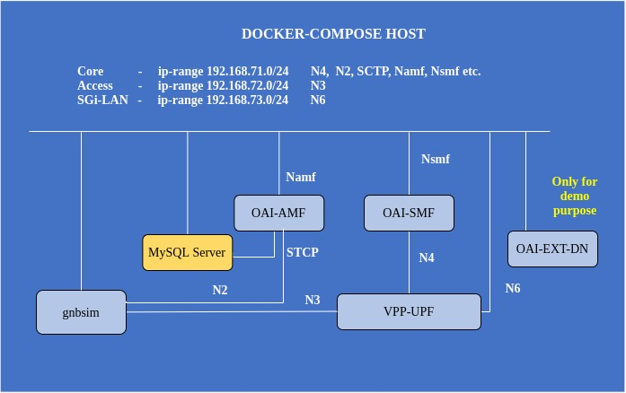

<table style="border-collapse: collapse; border: none;">
  <tr style="border-collapse: collapse; border: none;">
    <td style="border-collapse: collapse; border: none;">
      <a href="http://www.openairinterface.org/">
         
         </img>
      </a>
    </td>
    <td style="border-collapse: collapse; border: none; vertical-align: center;">
      <b>OpenAirInterface 5G Core Network Deployment and Testing with gnbsim</b>
    </td>
  </tr>
</table>

**TABLE OF CONTENTS**

1.  Pre-requisites
2.  Building Container Images
3.  Configuring Host Machines
4.  Configuring OAI 5G Core Network Functions
5.  [Deploying OAI 5G Core Network with VPP-UPF](#5-configuring-gnbsim-scenario)
6.  [Configuring gnbsim Scenario](#6-configuring-gnbsim-scenario)
7.  [Executing gnbsim Scenario](#7-executing-the-gnbsim-scenario)
8.  [Analysing Scenario Results](#8-analysing-the-scenario-results)
9.  [Trying some advanced stuff](#9-trying-some-advanced-stuff)

* In this demo the image tags and commits which were used are listed below, follow the [Building images](./BUILD_IMAGES.md) to build images with below tags. 

| CNF Name    | Branch Name             | Commit at time of writing                  | Ubuntu 18.04 | RHEL8          |
| ----------- |:----------------------- | ------------------------------------------ | ------------ | ---------------|
| AMF         | `develop`               | `82ca64fe8d79dbadbb1a495124ee26352f81bd7a` | X            | X              |
| SMF         | `nwi`                   | `0dba68d6a01e1dad050f47437647f62d40acaec6` | X            | X              |
| VPP_UPF     | `develop`               | `0e877cb5b80a9c74fa6abca60b95e2d3d22f7a52` | X            | X              |

 

